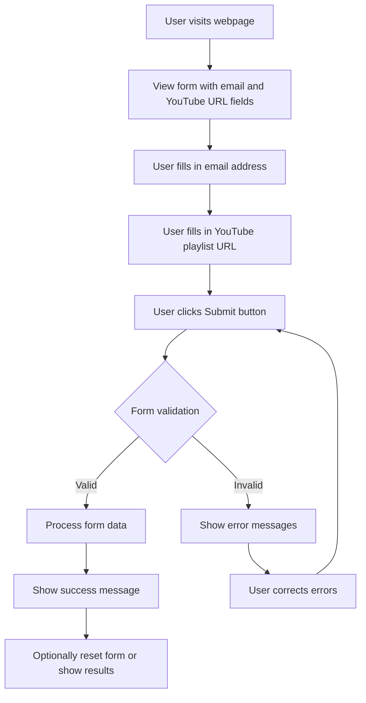
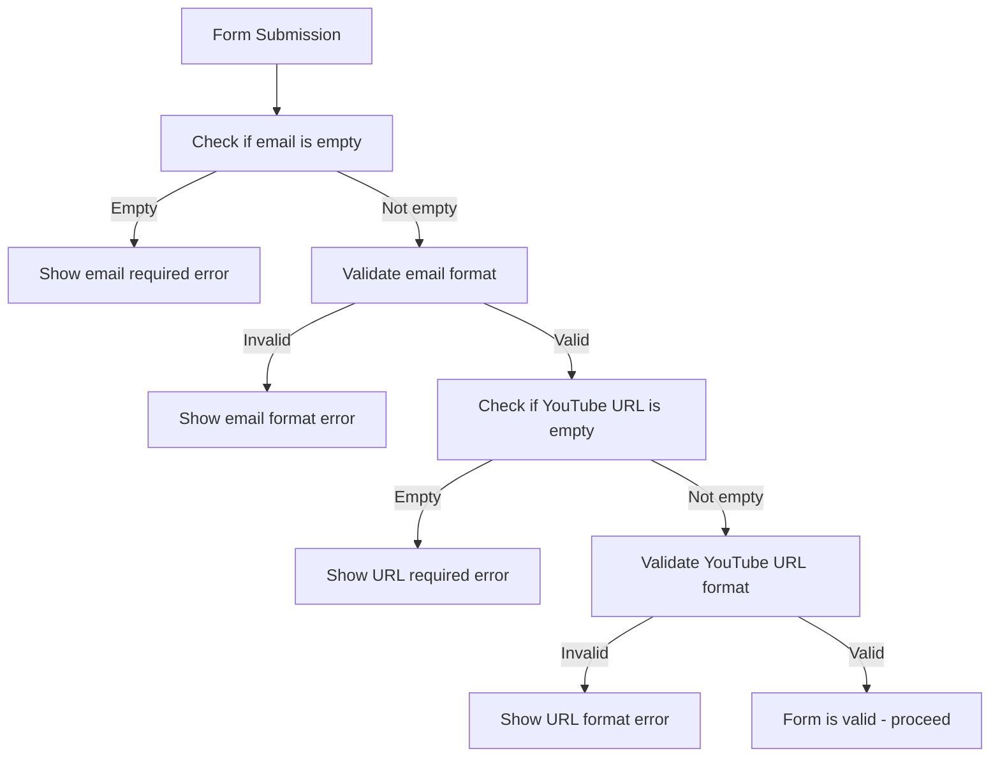
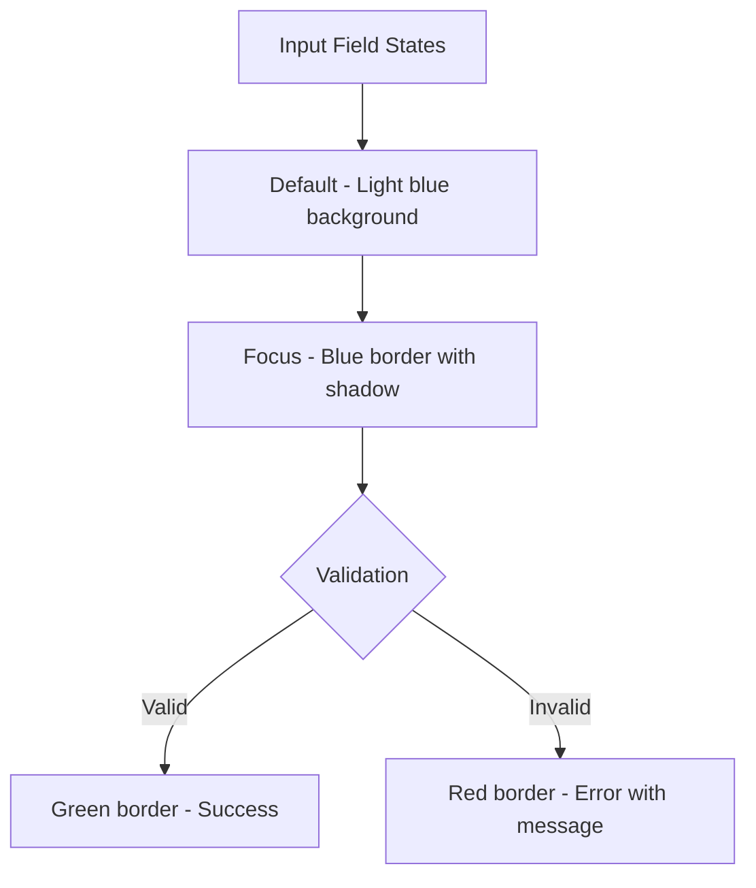

# User Workflow: YouTube Playlist NoteTaker

## Interaction Flow



## Form Validation Logic



## Visual Feedback States



## Button Interaction States

```mermaid
graph TD
    A[Submit Button] --> B[Default - Primary blue]
    B --> C[Hover - Darker blue]
    C --> D[Click - Pressed effect]
    D --> E{Form Status}
    E -->|Processing| F[Disabled - Loading spinner]
    E -->|Success| G[Success state - Green]
    E -->|Error| H[Error state - Red]